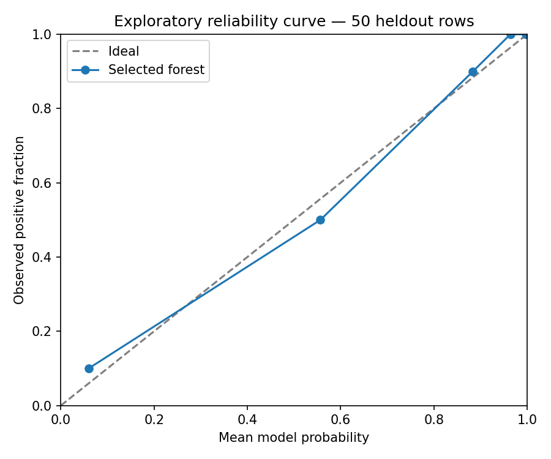

# تقرير تقييم نموذج PerdiaPredict

إصدار النموذج: `PP-grouped-2026-09-30-v1`. النموذج المختار: Random Forest، 300 شجرة. العتبة ثابتة 0.5.

## النتائج الفعلية على الاختبار المحجوز

| المقياس | النتيجة |
|---|---:|
| عدد السجلات | 50 |
| الدقة Accuracy | 92.00% (46/50) |
| فاصل الثقة التقريبي 95% للدقة | 81.2%–96.8% |
| الحساسية Recall | 97.14% (34/35) |
| النوعية Specificity | 80.00% (12/15) |
| Precision | 91.89% |
| F1 | 0.9444 |
| ROC AUC باستخدام الاحتمالات | 0.9638 |
| Brier، الأقل أفضل | 0.0732 |
| Log loss، الأقل أفضل | 0.2320 |

34 إيجابية صحيحة، 12 سلبية صحيحة، 3 إيجابيات خاطئة، وحالة إيجابية واحدة لم يكتشفها النموذج.

## طريقة العمل

الملف الأصلي 520 صفًا، منها 269 صفًا مكررًا بالكامل. بقيت 251 ملاحظة مختلفة و242 مجموعة مختلفة للمدخلات العشرة المستخدمة. هذه ليست أعداد مرضى مستقلين مؤكدة؛ الملف لا يحتوي معرفات مرضى.

حذفنا تكرار الصفوف الكامل ثم جمعنا المدخلات العشرة المتطابقة في المجموعة نفسها. التقسيم الخارجي StratifiedGroupKFold من خمس مجموعات، shuffle وseed=42؛ أول مجموعة هي الاختبار النهائي (50)، والباقي للتطوير (201). لا توجد مجموعة مشتركة بين التدريب والاختبار. مقارنة النماذج تمت بتقييم جماعي من خمس طيات داخل التطوير (seed=23). المعايرة sigmoid تستخدم ثلاث طيات جماعية إضافية (seed=71). معالجة العمر داخل pipeline وتُدرَّب في كل طية منفصلة. اخترنا أقل Brier في التطوير، مع log loss لكسر التعادل، قبل حساب الاختبار النهائي. لم نغيّر العتبة أو البذرة وفق نتيجة الاختبار.

| النموذج | دقة التحقق داخل التطوير | Brier | Log loss |
|---|---:|---:|---:|
| forest | 90.55% | 0.0674 | 0.2267 |
| forest_sigmoid | 91.04% | 0.0699 | 0.2392 |
| logistic | 88.06% | 0.0906 | 0.2847 |

المعايرة لم تحسّن معيار اختيار الاحتمالات؛ لذلك الإصدار المرفق يستخدم Random Forest المباشر. لا ندّعي أنه معاير طبيًا. Brier يجمع جودة التمييز والاحتمال ولا يثبت المعايرة وحده.

المنحنى استكشافي بسبب صغر الاختبار. الاحتمال المعروض ليس دقة النموذج 92%، ولا نسبة مؤكدة لإصابة فرد بعينه. عينة البيانات منتقاة من مستشفى واحد في Sylhet، بنغلاديش، ولا تمثل انتشار السكري في عموم السكان. حذف التكرار يغيّر وزن السجلات ونسبة الفئات. يلزم اختبار خارجي بمعلومات مرضى مستقلة ونتائج مخبرية، ومراجعة المعايرة، قبل الاعتماد السريري. لا يثبت هذا الاختبار التعميم إلى بلد آخر أو تقدير نوع السكري أو خطر الإصابة المستقبلي.

الميزات العشر مأخوذة من النظام السابق؛ اختيارها التاريخي قد استخدم كامل البيانات، لذلك هذا اختبار محجوز في عملية إعادة التدريب الحالية، وليس دراسة سريرية مستقلة تمامًا. لا يمكن تأكيد دقة النموذج القديم لأن تقسيمه الأصلي غير محفوظ. لا ندّعي تحسنًا مقاسًا على النموذج القديم.

## التعديلات في البرنامج

- حذف ضرب النسبة في عامل عدد الأعراض وحذف إعطاء 0% تلقائيًا عند غيابها.
- النسبة مباشرة من pipeline الذي أُجري عليه التقييم أعلاه. حفظنا نسخة التطوير المختبرة ولم نُعد تدريبها على الاختبار.
- لا نستبدل العمر المفقود بعمر 40 ولا نستبدل الجنس غير المدعوم تلقائيًا بذكر. النطاق التشغيلي للعمر 16–85، حسب نطاق التدريب. الاختبار البحثي شمل جميع السجلات المحجوزة حتى إن كان العمر خارج نطاق التدريب؛ التطبيق يرفض تقدير هذه الحالات.
- حفظ إصدار النموذج وطريقة الاحتمال والعتبة مع التقرير. عند اختلاف الإصدار، لا نفسّر فرق النسب كتغيّر في صحة المريض.
- الحفاظ على تعديل الملف الشخصي والسجل وتجميع التقارير، والتسجيل فقط عند إجراء فحص ناجح أو إعادة محاولة حفظه.
- النموذج يستخدم الميزات العشر في metadata فقط. السكر المخبري والأسئلة الإضافية مفيدة للتقرير لكنها لا تغيّر الاحتمال في هذا النموذج؛ لا يجوز ادعاء غير ذلك.

## التحقق والحدود

نجح تطابق احتمالات التطبيق مع نتائج الاختبار، وفحص رفض المدخلات غير المدعومة، وعدم فرض الصفر، وحماية مقارنة الإصدارات. نجحت اختبارات حفظ الفحص ومنع التكرار وعزل سجل المرضى وتوليد PDF. تم فحص syntax لجميع الملفات. لم يُختبر تشغيل واجهة Streamlit بالكامل في هذه البيئة لعدم توفر الحزمة.

## المصادر

- UCI، Islam et al. (2020)، DOI: 10.24432/C5VG8H، Early Stage Diabetes Risk Prediction، ترخيص CC BY 4.0: https://archive.ics.uci.edu/dataset/529/early+stage+diabetes+risk+prediction+dataset
- scikit-learn، Probability calibration: https://scikit-learn.org/stable/modules/calibration.html
- scikit-learn، Common pitfalls: https://scikit-learn.org/stable/common_pitfalls.html
- NIDDK، Diabetes Tests & Diagnosis: https://www.niddk.nih.gov/health-information/diabetes/overview/tests-diagnosis

الإنترنت استخدم لتدقيق منهجية التقييم ومصدر البيانات، وليس لإضافة حالات تدريب غير موثقة أو رفع النسبة يدويًا.
